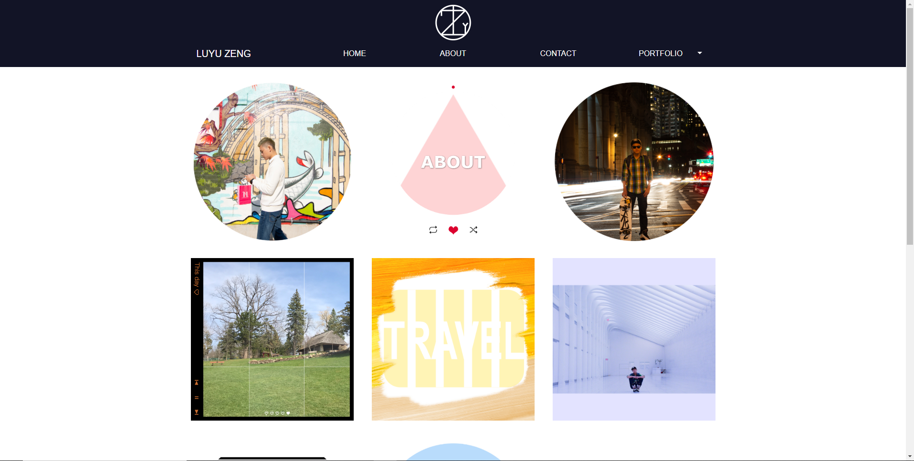
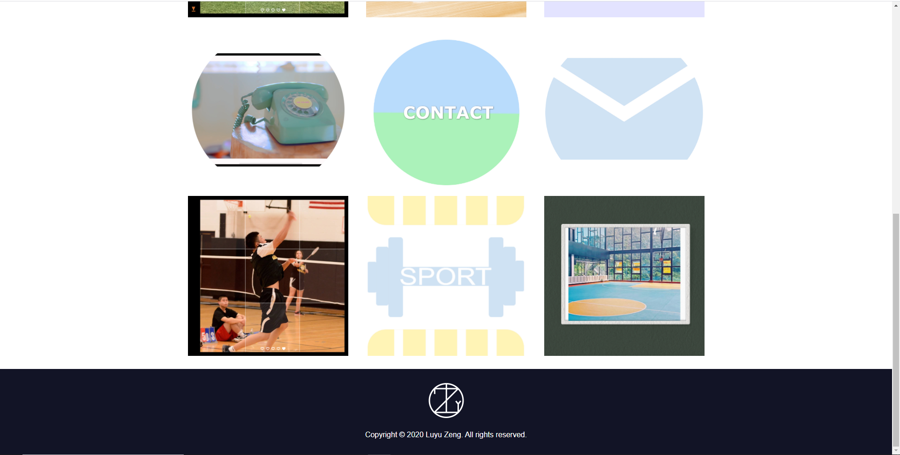
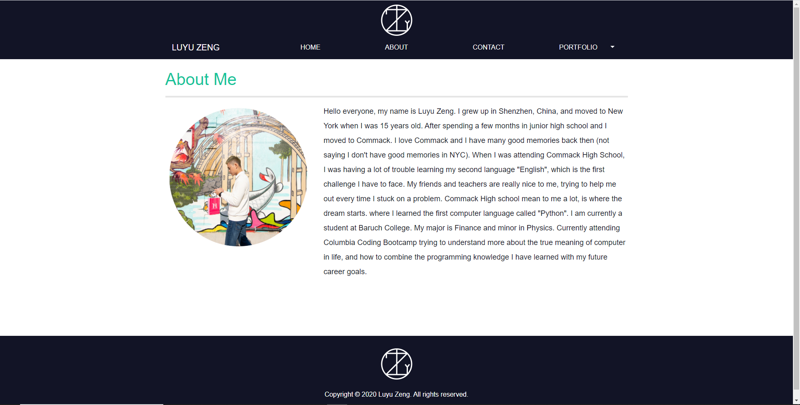
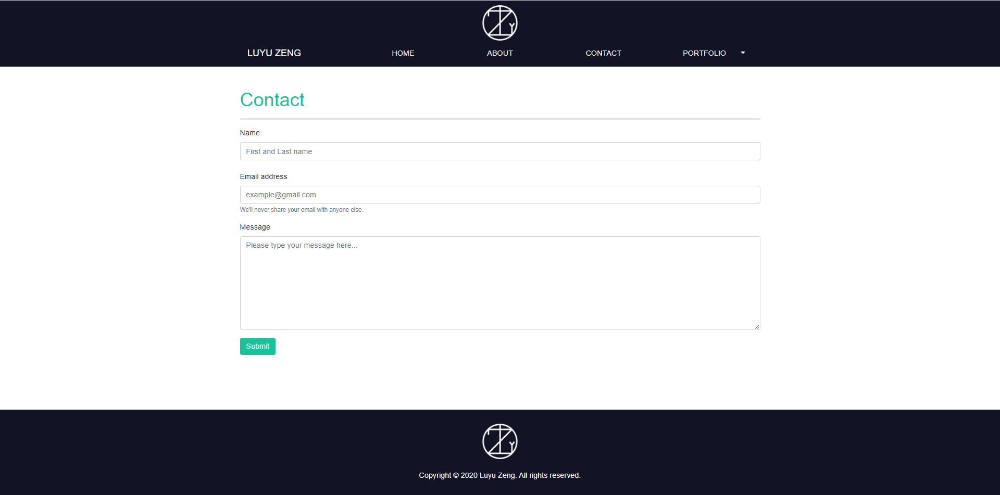
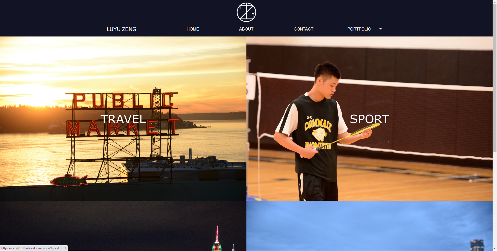
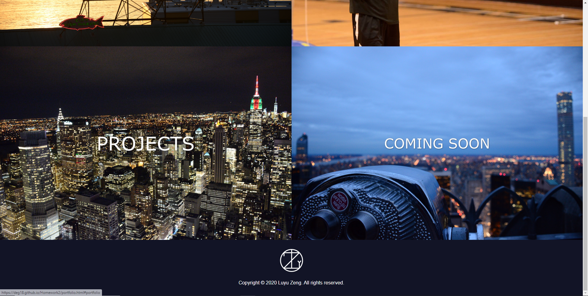
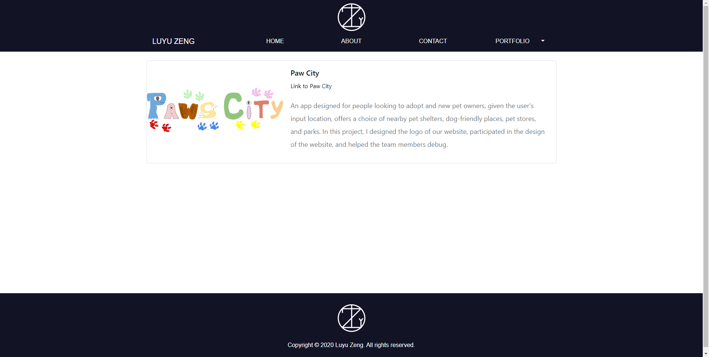
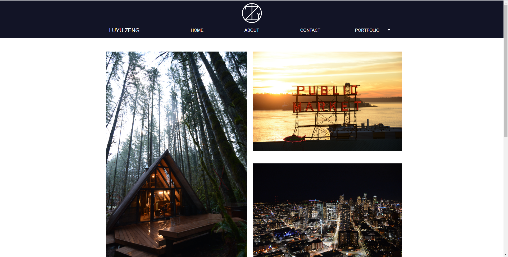
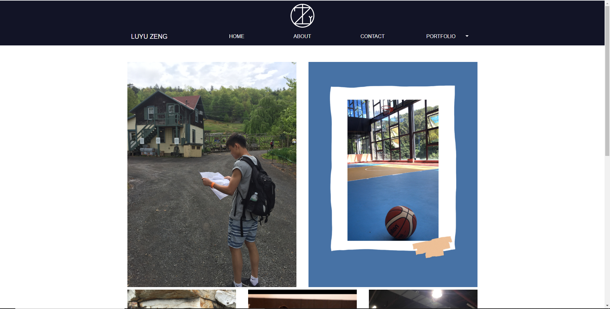

# Portfolio

- Link to
  [GitHub ](https://github.com/DEG18/Portfolio)
  and 
  [Portfolio](https://deg18.github.io/Portfolio/)

### Table of Contents

1. [Description](#description)
2. [License](#license)
3. [Contributing](#contributing)
4. [Questions](#questions)

### Description
- This is my React Portfolio. I designed many icons myself to make my home page look more diverse and more energetic! I also designed my logo through the abbreviation of my name. I used a lot of Bootstrap functions and stitch many functions together. I also added some of my own design elements and ideas on the basis of the Bootstrap code because I want to make this "Portfolio" be more perfect and beautiful! I hope you like it!

### License

- MIT

### Contributing

- Luyu Zeng

### Questions
##### Email:
- zengluyu252@gmail.com

#### Screenshot of Home Page

#### Screenshot of About Page

#### Screenshot of Contact Page

#### Screenshot of Portfolio Page

#### Screenshot of Projects Page

#### Screenshot of Travel Page

#### Screenshot of Sport Page

